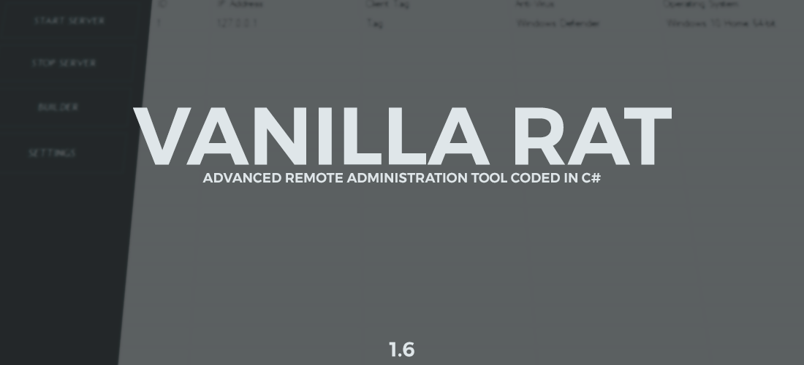
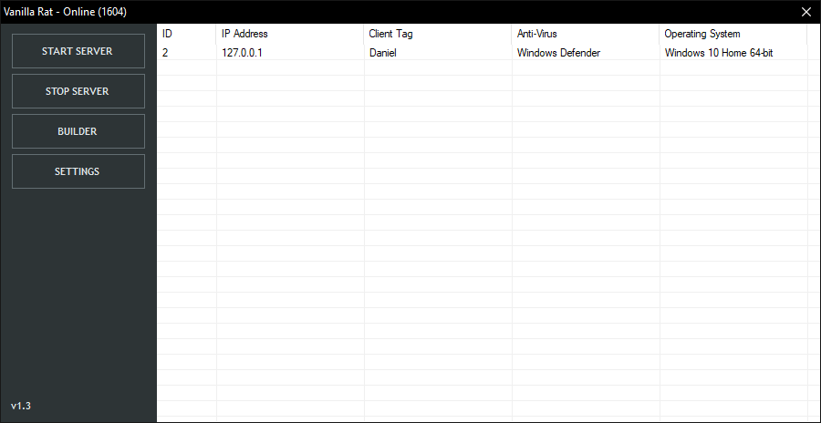

### Description:
VanillaRat is an advanced remote administration tool coded in C#. VanillaRat uses the Telepathy TCP networking library, dnlib module reading and writing library, and Costura.Fody dll embedding library.

### Features:
- Remote Desktop Viewer (With remote click)
- File Browser (Including downloading, drag and drop uploading, and file opening)
- Process Manager
- Computer Information 
- Hardware Usage Information (CPU usage, disk usage, available ram)
- Message Box Sender 
- Text To Speech
- Screen Locker
- Live Keylogger (Also shows current window)
- Website Opener 
- Application Permission Raiser (Normal -> Admin)
- Clipboard Text (Copied text)
- Chat (Does not allow for client to close form)
- Audio Recorder (Microphone)
- Process Killer (Task manager, etc.)
- Remote Shell 
- Startup 
- Security Blacklist (Drag client into list if you don't want connection. Press del. key on client to remove from list) 

### TODO - PROJECT COMPLETED (NEW PROJECT IN THE WORKS):
- Add password recovery
- Redesign networking system
- Bug Fixing

### How To Install:
**Release:**
1. Download the latest release from the releases section 
2. Ensure a designated port is opened, the default port is 1604
3. A DNS address is required, you may get one for free at https://no-ip.com/
4. Run the VanillaRat.exe and have fun! 

Note: If you accidentally run VanillaRatStub.exe, you can end the process by opening task manager and killing VanillaRatStub.

**Debug:**

1. Open the solution file
2. Ensure dnlib is installed on the VanillaRat project
3. Ensure Costura.Fody, and Telepathy is installed on both the VanillaRat project and the VanillaRatStub project
4. Build the VanillaRatStub project.
5. Build the VanillaRat project, open the bin of the VanillaRatStub project, and drag the VanillaRatStub.exe file into the bin of the VanillaRat project.
6. Run VanillaRat.exe and have fun! 
7. If any modification is made to VanillaRat or VanillaRatStub steps 4-5 need to be repeated. 

### Using Vanilla Rat:

**Setting The Server Up:**
To get started you must have at least one open port that you do not use with other applications. The default port is 1604. You must also have a dynamic dns address which you can get from https://no-ip.com/.
To get started build a client by clicking the builder button in the main settings, please note the client tag is how you will know which client is which (assuming you are not using the program maliciously), and the name is the output exe file. Enter your DNS address and port into their designated fields. If you do not know what the update interval is you can leave it as is. Once you are done click build. 
Next set the settings up, fill your port in the port field if you changed it, if you do not know what the update interval is you can leave it as is. You can now hit the start server button and the server will now listen for connections. 

**Client Options:** 
Once a client is connected you can select the client and right click on the client to bring up a menu of options, or you can select the client and click start remote desktop if you wish to start the remote desktop. Some client options have special functions as listed below: 
- Process Manager (Get Running Applications): Right click to bring up options for refreshing and closing processes. 
- File Browser: Right click to bring up options for downloading, uploading, refrshing, and deleting files. Note that for uploading you may drag and drop a file into the browser to upload it into the directory it is currently in.
- Clipboard Text: Note you do not have to close the dialog if you want to get another copy of the currently copied text on the client. Just hit Get Clipboard Text again and the dialog will automatically update.

### Screenshot:

### Demo: 

## A Special Thanks To:

**NinjahZ**

**NYAN-x-CAT (https://github.com/NYAN-x-CAT)** 

## Important Disclaimer:

**I, the creator, am in no way responsible for any actions that you may make using this software. You take full responsibility with any action taken using this software. Please take note that this application was designed for educational purposes and should never be used maliciously. By downloading the software or source to the software, you automatically accept this agreement.**
